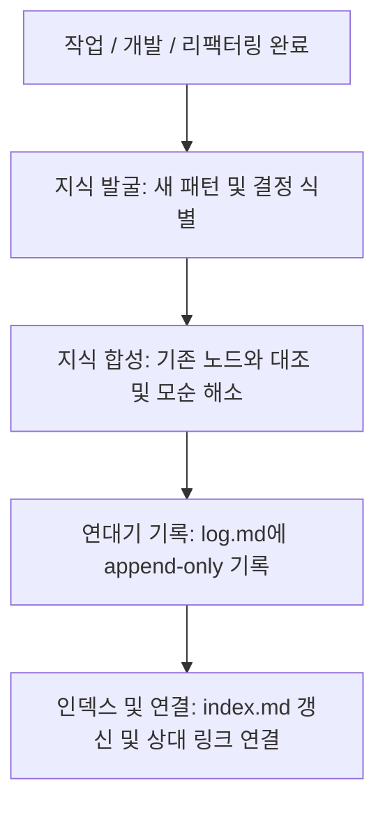

# 지식 하네스 운영 체계 (Knowledge Harness: LLM Wiki)

이 문서는 프로젝트의 지식이 어떻게 생성되고, 분류되고, 인덱싱되어 **복리로 축적(Compounding)**되는지를 정의하는 지식 운영 체계입니다.

---

## 1. 지식 관리 구조 (Architectural Layers)

프로젝트의 모든 영속적 지식은 **"LLM Wiki"** 패턴에 따라 3개 계층으로 관리됩니다.

| 계층 | 경로 | 역할 | 불변성 |
|---|---|---|---|
| **Raw Sources** | `/raw/` (또는 사용자 지시문) | 사용자의 원본 요청, 대화, 외부 데이터 등 가공되지 않은 소스 | 불변 (수정 금지) |
| **The Wiki** | `.gemini/knowledge/wiki/` | OKF 규격에 따라 완전히 구조화되고 상호 연결된 마크다운 문서군 | 가변 (합성/정제) |
| **The Schema** | `AGENTS.md`, `index.md`, `SKILL.md` | 위키와 에이전트 협업 규칙을 정의하는 헌법 | 최상위 기준선 |

---

## 2. 지식 생성 라이프사이클 (The Compounding Loop)



1. **지식 발굴 (Discover)**: 작업 도중 도출된 새로운 아키텍처 결정, 도메인 지식, 버그 원인과 해결 패턴을 식별합니다.
2. **지식 합성 (Synthesize)**: 새로운 지식을 단독 문서로 방치하지 않고, 기존 노드와 대조하여 모순을 해소하고 하나의 완성된 문서로 통합합니다.
3. **연대기 기록 (Log)**: `log.md`에 작업 일자, 분류, 요약을 기록하여 감사 추적(Audit Trail)을 유지합니다.
4. **인덱스 및 연결 (Index & Link)**: `index.md`에 새 노드를 배치하고 관련 노드 간에 마크다운 상대 경로 링크를 연결합니다.

---

## 3. 위키 노드 작성 규칙 (OKF v0.1)

1. **YAML Frontmatter 필수**:
   모든 위키 노드는 최상단에 규격 메타데이터를 포함해야 합니다.
   ```yaml
   ---
   okf_version: "0.1"
   type: node
   title: "문서 제목"
   description: "핵심 요약 (1~2문장)"
   tags: [태그1, 태그2]
   timestamp: YYYY-MM-DDTHH:MM:SSZ
   ---
   ```
2. **상대 경로 링크 사용**:
   Obsidian 전용 문법(`[[Node]]`) 대신 표준 마크다운 상대 경로 링크(`[이름](./relative/path.md)`)를 사용합니다.
3. **SSOT(Single Source of Truth) 원칙**:
   동일한 사실을 여러 문서에 분산 복제하지 않고, 한 문서에서 소유하고 다른 문서는 링크로 참조합니다.
4. **아카이빙 원칙**:
   만료되거나 대체된 문서는 삭제하지 않고 `archive/` 디렉토리로 이동하며, 상단에 `[DEPRECATED]` 배너와 대체 노드 링크를 남깁니다.

---

## 4. 담당 스킬

- **사서 스킬**: [wiki-librarian](../../skills/wiki-librarian/SKILL.md)
- **오케스트레이션**: [orchestration](../../skills/orchestration/SKILL.md)

---
*연결 노드:* [Operating Principles](./operating_principles.md), [Architecture Reference](./architecture_reference.md), [Index](../index.md)
