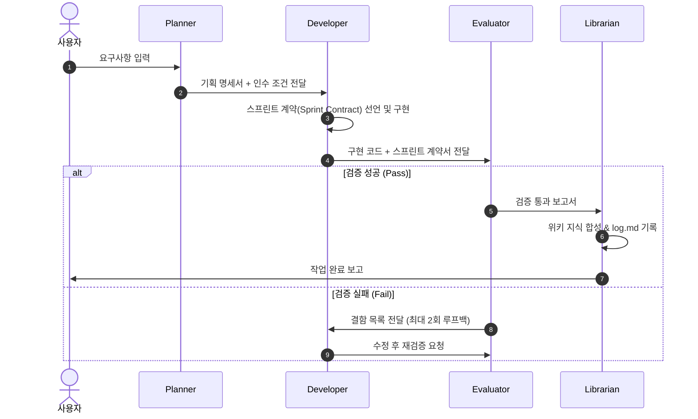

# `orchestration` Skill

이 스킬은 프로젝트 내에서 기획(Planner), 개발(Developer), 평가(Evaluator), 사서(Librarian) 에이전트가 협업하는 프로세스를 정의합니다.
모든 서브에이전트 정의(`.gemini/agents/`) 및 작업 흐름의 단일 진실 공급원(SSOT)입니다.

---

## 1. 에이전트 토폴로지 및 역할

| 에이전트 | 역할 | 주 책임 |
|---|---|---|
| **Planner** | 요구사항 기획 & 아키텍처 설계 | 기능 요구사항 분석, UX/데이터 플로우 정의, 인수 조건(Acceptance Criteria) 명세 |
| **Developer** | 구현 & 단위 테스트 | 스프린트 계약 체결, 계약 준수 구현, TDD 기반 검증 코드 작성 |
| **Evaluator** | 품질 보증 & 회귀 평가 | 스프린트 계약 기준 독립적 검증, 회귀 테스트, 승인 또는 결함 루프백 |
| **Librarian** | 지식 큐레이션 & 위키 동기화 | 결정 사항 및 설계 지식 합성, `log.md` 연대기 기록, `index.md` 갱신 |

---

## 2. 핸드오프 워크플로우 (Hand-off Protocol)

---

## 3. 단계별 입출력 규격

### 1단계: 기획 (Planner)
- **입력**: 사용자 요청, 기존 위키 문서, 프로젝트 기준선
- **산출물**:
  - 기능 명세 및 사용자 여정
  - 데이터 모델 및 인터페이스 규격
  - 측정 가능한 인수 조건 (Acceptance Criteria)

### 2단계: 구현 (Developer)
- **입력**: Planner의 기획 명세서
- **산출물**:
  - **스프린트 계약서 (Sprint Contract)**: 작업 전 완료 기준(DoD)을 명시
  - 프로덕션 코드 및 단위 테스트
- **준수 규칙**:
  - 계약 우선: 코드 작성 전 완료 기준을 먼저 선언합니다.
  - 최소 침습: 요구사항 범위를 벗어난 인접 리팩터링을 지양합니다.

### 3단계: 검증 (Evaluator)
- **입력**: Developer의 구현 코드 + 스프린트 계약서
- **산출물**:
  - 검증 결과 보고서 (PASS / FAIL)
  - 결함 목록 및 재현 단계 (FAIL인 경우)
- **루프백 규칙**:
  - 실패 시 결함 목록을 Developer에게 전달하여 수정을 요청합니다.
  - 최대 2회 루프백 후에도 해결되지 않을 경우 Planner에게 요구사항 재검토를 요청합니다.

### 4단계: 지식 합성 (Librarian)
- **입력**: 완료된 기능 코드, 검증 결과
- **산출물**:
  - `.gemini/knowledge/wiki/log.md` 연대기 로그 추가
  - `.gemini/knowledge/wiki/index.md` 갱신
  - 필요 시 `core/` 내 아키텍처/운영 문서 업데이트

---

## 4. 핵심 참조 문서

- 운영 원칙: [Operating Principles](../../knowledge/wiki/core/operating_principles.md)
- 지식 하네스: [Knowledge Harness](../../knowledge/wiki/core/knowledge_harness.md)
- 스프린트 계약 템플릿: [SPRINT_CONTRACT_TEMPLATE](../core-developer/SPRINT_CONTRACT_TEMPLATE.md)
